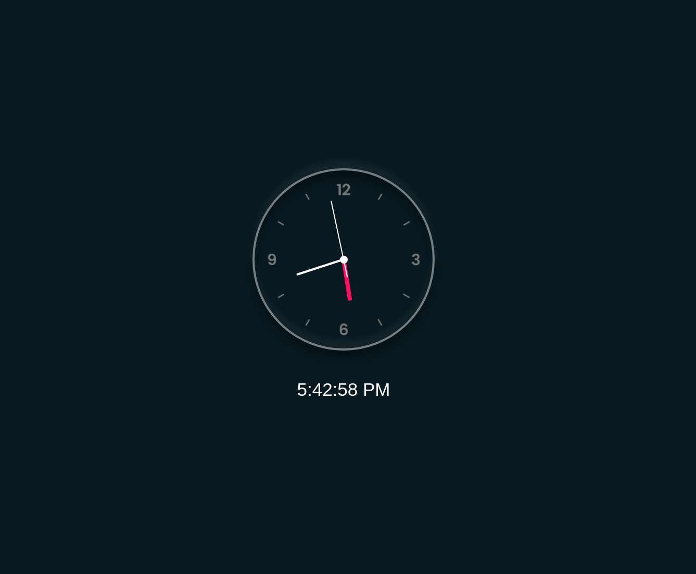

# Clock-Js-Vanilla
## <h3 align="center"> A simple clock made in Javascript </h3>
     
    

  <a href="https://cloock-app.netlify.app">
  

  <h3 align="center">
    <a href="https://cloock-app.netlify.app">
      Click Here to Access Demo 
  </h3>
